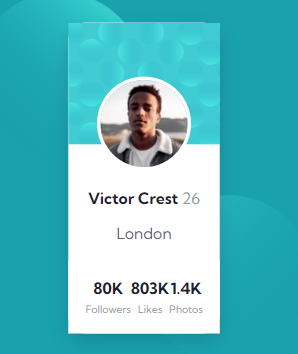

# Make It Real - NAME OF THE PROJECT

This is a solution to the PROFILE CARD COMPONENT preview card component project of the Make It Real course.

## Table of contents

- [Overview](#overview)
  - [The challenge](#the-challenge)
  - [Screenshot](#screenshot)
- [My process](#my-process)
  - [Built with](#built-with)
  - [What I learned](#what-i-learned)
  - [Continued development](#continued-development)
  - [Useful resources](#useful-resources)
- [Author](#author)
- [Acknowledgments](#acknowledgments)


## Overview

### The challenge

Users should be able to:

- Replic the page web
- REACT
- Practice the components

### Screenshot
DESKTOP

MOBILE



## My process

### Built with

- REACT
- COMPONENTS

### What I learned

Use this section to recap over some of your major learnings while working through this project. Writing these out and providing code samples of areas you want to highlight is a great way to reinforce your own knowledge.

To see how you can add code snippets, see below:

```html
<div className='price'>
      <p className='price__current'>{price}</p>
      <p className='price__old'>{oldPrice}</p>
    </div>
```css
#root {
  background-color: #19a1ad;
  background-image: url(./assets/bg-pattern-top.svg), url(./assets/bg-pattern-bottom.svg);}
```
### Continued development


## Author

- GITHUB - [@JohanPinares](https://github.com/JohanEmersonPinares)
- linkedin - [@JohanPinares](https://www.linkedin.com/in/johan-emerson-pinares/)


## Acknowledgments
